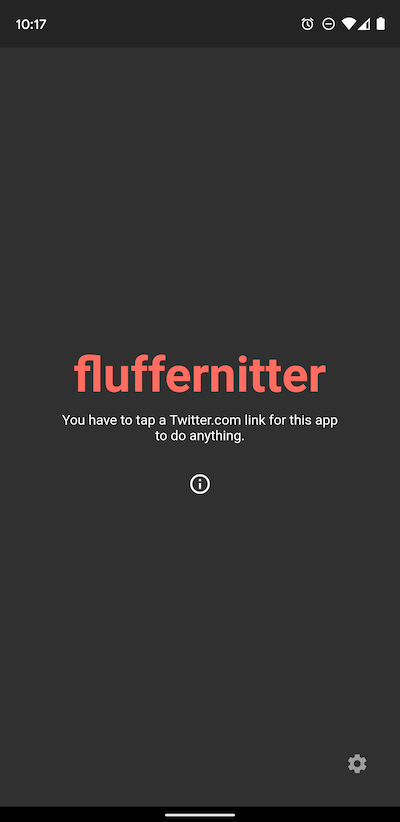

# fluffernitter

A Twitter -> [Nitter.net](https://nitter.net) link redirector app written in Flutter

## Description

This app registers itself able to handle **twitter.com**. **mobile.twitter.com** and **t.co** links and redirects them to the approproate nitter.net page equivalent. 

## How To

Please [visit the wiki](https://github.com/aaronfg/fluffernitter/wiki) for more screenshots, gifs, and a walkthrough of how to use the app.

## FAQ

**Q: What is Nitter.net?**

**A:** Nitter.net is a Twitter front-end focused on privacy. [Read a more detailed explanation at the nitter.net website](https://nitter.net/about)

**Q: Why doesn't clicking on some links work?**

**A:** Nitter.net doesn't support all types of Twitter features/urls. If you are getting nitter.net pages that don't have info or show "Unsupported feature", that's out of my hands. All I can do is redirect you to nitter.net and hope it supports the twitter url you clicked on.

Two types of Twitter urls that I know are not supported (as of 8/29/2020) of are: 

1. [Topic links](https://help.twitter.com/en/using-twitter/follow-and-unfollow-topics).
2. Article links

However, if you have a twitter url that works in your desktop web browser with nitter but fails in my app, please [open an issue](https://github.com/aaronfg/fluffernitter/issues) and I'll try and get a fix out.
